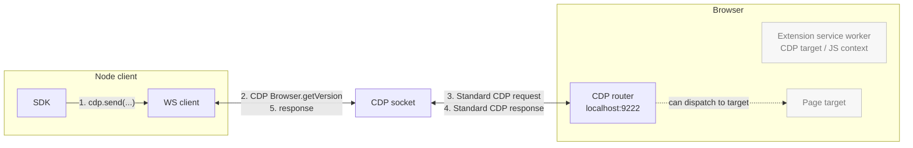
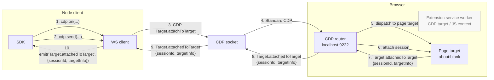
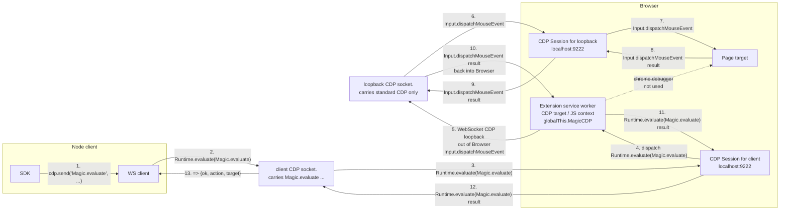
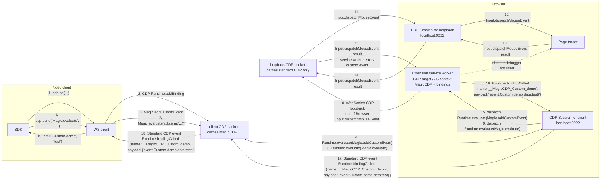

# MagicCDP

CDP sucks today. It is difficult for agents and humans to use without a library because it lacks:

- the ability to use it statelessly without maintaining mappings of sessionIds, targetIds, frameIds, execution context IDs, backendNodeId ownership, and event listeners
- the ability to register custom CDP commands, abstractions, and events
- the ability to easily call `chrome.*` extension APIs for things like `chrome.tabs.query({ active: true })`
- the ability to reference pages and elements with stable references across browser runs, such as XPath, URL, and frame index, instead of backendNodeId, targetId, and frameId

- [Chrome DevTools Protocol](https://chromedevtools.github.io/devtools-protocol/tot/Extensions/)

While I had high hopes for WebDriver BiDi, unfortunately it solves almost none of these issues.

`MagicCDP` does not aim to solve all of these issues directly either. It exposes three new primitives that you can use to customize and extend CDP:

- `Magic.evaluate`: run code in the `MagicCDP` extension service worker target, where `chrome.*` APIs and a `cdp` bridge back to the client are available
- `Magic.addCustomCommand`: register a custom CDP command that is handled by the expression you provide
- `Magic.addCustomEvent`: register a custom CDP event type with an expected payload schema

Instead of inventing yet another browser driver library, MagicCDP fixes the issue at the root.

MagicCDP uses an automatically injected extension bridge, giving you the ability to keep using the normal CDP websocket transport with extra features that work without IPC, native messaging, or external services for custom side-channel messages.

```ts
import { MagicCDPClient } from 'magic-cdp'

const cdp = await MagicCDPClient({
  cdp_url: 'http://localhost:9222', // ws://..., http://..., and https://... CDP endpoints work
}).connect()
```

## Run Extension Code

Run code in an extension service worker context with access to `chrome.runtime`, `chrome.tabs`, and other extension APIs:

```ts
const foregroundTab = await cdp.send('Magic.evaluate', {
  expression: '(await chrome.tabs.query({ active: true, lastFocusedWindow: true }))[0]',
})

console.log(foregroundTab.url)
```

## Register Custom Commands

Make extension snippets reusable by registering them as custom CDP commands:

```ts
await cdp.send('Magic.addCustomCommand', {
  name: 'Custom.getForegroundTabInfo',
  paramsSchema: cdp.types.chrome.tabs.queryInfo,
  resultSchema: cdp.types.chrome.tabs.Tab,
  expression: 'async (queryInfo) => (await chrome.tabs.query({ active: true, lastFocusedWindow: true, ...queryInfo }))[0]',
})

const foregroundTab = await cdp.send('Custom.getForegroundTabInfo')
console.log(foregroundTab.url)
```

Schemas are currently metadata. JSON-schema-like values are mirrored into the extension; non-JSON schema objects such as Zod values are kept on the client.

## Register Custom Events

Register a custom event name and expected payload shape, then install logic that emits it:

```ts
await cdp.send('Magic.addCustomEvent', {
  name: 'Custom.foregroundTargetChanged',
  payloadSchema: z.object({ targetId: cdp.types.Target.TargetId }),
})

await cdp.send('Magic.evaluate', {
  expression: `async ({ cdpSessionId }) => {
    const cdp = MagicCDP.attachToSession(cdpSessionId)

    chrome.tabs.onActivated.addListener(async (activeInfo) => {
      const targets = await chrome.debugger.getTargets()
      const target = targets.find(target => target.tabId === activeInfo.tabId)
      if (target) await cdp.emit('Custom.foregroundTargetChanged', { targetId: target.id })
    })
  }`,
  params: { cdpSessionId: cdp.sessionId },
})

cdp.on('Custom.foregroundTargetChanged', console.log)
```

If `cdpSessionId` is omitted, emitted custom events are broadcast to all connected CDP clients that installed the same event binding.

## Current Repository

- `client.mjs`: exports `MagicCDPClient`, `MagicCDP`, and `RawCDP`; it also contains a small runnable demo when executed directly.
- `extension/service_worker.js`: exposes `globalThis.MagicCDP` and `globalThis.Magic` inside the extension service worker.
- `extension/manifest.json`: MV3 extension manifest with `tabs` access and `debugger` access enabled by default.

Run the local demo:

```sh
CHROME_PATH="/Applications/Google Chrome Canary.app/Contents/MacOS/Google Chrome Canary" node client.mjs
```

Run the session-routing demo:

```sh
CHROME_PATH="/Applications/Google Chrome Canary.app/Contents/MacOS/Google Chrome Canary" node client.mjs --session-routing
```

That demo creates two separate page targets and one cross-site OOPIF, then runs `Runtime.evaluate` against each target using only `targetId`. No manual `sessionId` is passed.

Or pass a Chromium or Chrome Canary executable:

```sh
node client.mjs "/Applications/Google Chrome Canary.app/Contents/MacOS/Google Chrome Canary"
```

Stock Google Chrome is intentionally rejected for local launches. Chrome Canary is currently the verified path for `Extensions.loadUnpacked`; local Chromium builds also work if they expose that CDP method with `--enable-unsafe-extension-debugging`.

## Architecture

### Lifecycle

1. User creates a client in their local Node process:

```ts
const cdp = MagicCDPClient({ cdp_url })
```

2. `await cdp.connect()`:

- connects to the running browser through normal raw CDP and stores that websocket in `cdp._cdp`
- loads the MagicCDP extension with `Extensions.loadUnpacked(...)`
- discovers and attaches to the `chrome-extension://<magiccdpserverid>/service_worker.js` service worker target
- configures server-side routing defaults in the service worker
- sends one `Magic.ping` custom command and waits for a `Magic.pong` custom event to confirm round-trip behavior
- updates `cdp._extTargetId` and `cdp._extCdpSessionId` to point to the extension service worker target

3. `await cdp.send('Magic.addCustomEvent', { name: 'Custom.someEvent' })`:

- calls `Runtime.addBinding({ name: '__MagicCDP_Custom_someEvent' })` on the extension service worker session
- registers the event name and binding name in `globalThis.MagicCDP`
- maps later `Runtime.bindingCalled` payloads back to local `cdp.on(...)` listeners

4. `await cdp.send('Magic.evaluate', { expression })`:

- calls `Runtime.evaluate` on the extension service worker session
- evaluates the provided expression; function expressions are called with `(params, context)`
- exposes `context.cdp`, `context.MagicCDP`, `context.chrome`, and the extension global `MagicCDP`

5. `cdp.on('Custom.someEvent', listener)`:

- listens locally on the Node client
- receives events emitted by extension code through `cdp.emit(...)`
- filters events by `cdp.sessionId` when the event was emitted to a specific session

### `MagicCDPClient`

`connect()` handles:

- initial raw CDP connection to the browser
- extension upload or discovery
- service worker target attachment
- `Runtime.enable` and `Runtime.addBinding` setup
- base custom event setup for `Magic.pong`
- `Magic.ping` latency measurement

`send(method, params, options)` routes:

- `Magic.evaluate`, `Magic.addCustomCommand`, and `Magic.addCustomEvent` through built-in client handlers
- `Magic.*` and `Custom.*` commands through the extension service worker by default
- standard CDP commands directly to the browser CDP websocket by default

### `MagicCDPServer`

`MagicCDPServer` lives inside the injected extension service worker.

The service worker can be very small because the client can bootstrap behavior with `Runtime.evaluate`. In practice this repository defines `MagicCDPServer` in `service_worker.js` so startup is faster and the core primitives are available immediately.

The extension exists to guarantee there is at least one target with the required `chrome.*` APIs enabled through extension permissions. This repository requests `debugger` by default so `chrome_debugger` routing works out of the box, but that upstream remains optional in practice when users route through direct CDP or loopback CDP.

Available server helpers:

```ts
MagicCDPServer.discoverLoopbackCDP()
MagicCDPServer.requestLoopbackCDP()
MagicCDPServer.requestDebuggerCDP()
MagicCDPServer.attachToSession(cdpSessionId)
```

## Routing

Users can customize how non-`Magic.*` CDP commands are handled.

```ts
type CDPUpstream =
  | 'service_worker'
  | 'direct_cdp'
  | 'auto'
  | 'loopback_cdp'
  | 'chrome_debugger'
```

Client mode A sends non-`Magic.*` commands directly to the browser CDP target with no extension involvement:

```ts
const version = await cdp.send('Browser.getVersion')
```

Client mode B sends non-`Magic.*` commands to the extension service worker target and lets it intercept, manage, reject, or forward them:

```ts
const cdp = MagicCDPClient({
  direct_cdp_url: 'http://some-remote-host:9222',
  routes: {
    'Magic.*': 'service_worker',
    'Custom.*': 'service_worker',
    '*.*': 'service_worker',
  },
  server: {
    loopback_cdp_url: 'http://localhost:9222',
    routes: {
      'Magic.*': 'service_worker',
      'Custom.*': 'service_worker',
      'Browser.*': 'loopback_cdp',
      '*.*': 'chrome_debugger',
    },
  },
})
```

Server modes:

- `service_worker`: handle commands in the extension service worker
- `auto`: try verified `localhost:9222` loopback CDP first, then fall back to `chrome.debugger`
- `loopback_cdp`: forward commands through a CDP websocket reachable from the browser, useful for `Browser.*` commands that `chrome.debugger` does not support
- `chrome_debugger`: forward target-scoped commands through `chrome.debugger.sendCommand`; if no `debuggee`, `tabId`, `targetId`, or `extensionId` is provided, the active last-focused tab is used

The default client route is conservative:

```ts
{
  'Magic.*': 'service_worker',
  'Custom.*': 'service_worker',
  '*.*': 'direct_cdp',
}
```

The default server route is:

```ts
{
  'Magic.*': 'service_worker',
  'Custom.*': 'service_worker',
  '*.*': 'auto',
}
```

When default `auto` routing is used, the extension probes only `http://127.0.0.1:9222`. It does not trust the port just because it is open or has the same extension installed. The client writes a per-connection browser token into the service worker over the known direct CDP connection, and loopback discovery verifies that same token through `localhost:9222` before using it.

### Session Routing Middleware

Direct CDP mode can optionally infer flattened target sessions so users can omit `sessionId` for target-scoped commands:

```ts
const cdp = await MagicCDPClient({
  cdp_url: 'http://localhost:9222',
  sessionRouting: true,
}).connect()

const { targetId } = await cdp.send('Target.createTarget', { url: 'https://example.com' })
const result = await cdp.send('Runtime.evaluate', {
  targetId,
  expression: 'location.href',
  returnByValue: true,
})
```

When enabled, the client indexes flattened `Target.attachedToTarget` / `Target.detachedFromTarget`, frame, and execution-context events. If a direct CDP request omits `sessionId` but includes `targetId`, `frameId`, `executionContextId`, or `contextId`, MagicCDP resolves the right session and sends the command there. Manual `sessionId` still wins.

## Detailed Transport Explainer

```text
external Node client
  -> browser CDP WebSocket
     - normal CDP: cdp.send("Browser.getVersion")
     - normal events: cdp.on("Target.attachedToTarget")

external Node client
  -> extension service worker CDP target
     - custom command: Magic.evaluate(...)
     - custom command registration: Magic.addCustomCommand(...)
     - custom events: Runtime.addBinding("__MagicCDP_Custom_someEvent")
```

Normal protocol methods can stay on the browser CDP socket, or they can be routed through the extension service worker if the client config chooses interception. Magic methods are handled by evaluating known `globalThis.MagicCDP.*` behavior inside the extension service worker target. From there, the extension can initiate its own WebSocket connection out to a verified `localhost:9222` CDP endpoint, or use `chrome.debugger` against the active tab or an explicitly provided debuggee. Custom events come back through `Runtime.addBinding`, which emits `Runtime.bindingCalled` on the service worker CDP connection.

## Flow Diagrams

### 1. Normal CDP Call / Response



### 2. Normal CDP Event Listener / Event



### 3. MagicCDP Custom Call / Response



The same transport shape applies to `Magic.addCustomCommand`: the client installs a named command handler in the service worker, and later `cdp.send('Custom.someCommand', params)` is routed back through `globalThis.MagicCDP.handleCommand(...)`.

### 4. MagicCDP Custom Event Listener / Event



## Lifecycle Details

1. `client.mjs` launches Chrome Canary or Chromium with:
   - `--remote-debugging-port=<free port>`
   - `--remote-allow-origins=*`
   - `--enable-unsafe-extension-debugging`
2. The client reads `/json/version` and connects to the browser WebSocket.
3. The client loads the extension with `Extensions.loadUnpacked(...)`; it does not use `--load-extension`.
4. The client calls `Target.setAutoAttach({ flatten: true, autoAttach: true, waitForDebuggerOnStart: false })` at the start of each CDP websocket connection.
5. The client scans `Target.getTargets` for the `chrome-extension://<extension-id>/service_worker.js` target.
6. The client attaches to that service worker target, enables `Runtime`, and installs `Runtime.addBinding("__MagicCDP_<event>")` for each custom event.
7. Magic calls go through `cdp.send('Magic.evaluate' | 'Magic.addCustomCommand' | 'Magic.addCustomEvent', ...)`, which performs `Runtime.evaluate` in the service worker target.
8. Registered custom commands go through `cdp.send('Custom.someCommand', params)`, which evaluates `MagicCDP.handleCommand(...)` in the service worker target.
9. When extension logic emits an event, the service worker calls the installed binding, for example `globalThis.__MagicCDP_Custom_demo(JSON.stringify(...))`; the client receives `Runtime.bindingCalled` and re-emits it through Node `EventEmitter`.

## Demo Surface

```js
const cdp = await MagicCDPClient({
  cdp_url: "http://localhost:9222",
}).connect();

console.log(await cdp.send("Browser.getVersion"));

cdp.on("Target.attachedToTarget", console.log);
cdp.on("Custom.demo", console.log);

await cdp.send("Magic.addCustomEvent", { name: "Custom.demo" });
await cdp.send("Magic.addCustomCommand", {
  name: "Custom.echo",
  expression: "async (params, { cdp }) => { await cdp.emit('Custom.demo', params); return params; }",
});
console.log(await cdp.send("Custom.echo", { value: "test" }));
```

`Magic.ping` is a built-in custom command in the extension. The client registers `Magic.pong` as a custom event during bootstrap, sends `Magic.ping`, and uses the `Magic.pong` event to confirm that the service worker command path and event path both work:

```js
{ ok: true }
```

## Constraints

- This does not add real CDP methods like `Custom.echo` to Chrome. The external client owns the routing convention.
- The service worker target must be visible through `Target.getTargets`; MagicCDP discovers it by extension id and service worker URL.
- `Runtime.evaluate` and `Runtime.addBinding` are used only against the extension service worker target, not page JS.
- Page JavaScript does not see the command surface or custom event binding.
- `Extensions.loadUnpacked` must be available over CDP; this is why Chrome Canary with `--enable-unsafe-extension-debugging` is the verified local path.
- `--remote-allow-origins=*` is needed so extension-origin WebSockets can connect to an exposed loopback CDP port.
- Default service-worker routing only trusts `localhost:9222` after verifying a per-client browser token through the service worker target, so it does not accidentally connect to a different browser that happens to have the same extension installed.

## Alternatives Explored

- `chrome.debugger`: can send CDP commands to targets, and MagicCDP now uses it as the fallback service-worker upstream. It still does not expose active remote-debugging clients or their raw request/response streams.
- Connecting the extension directly to `ws://localhost:9222`: the root is not a CDP WebSocket endpoint. The real browser endpoint is discovered from `/json/version`.
- Listening to another CDP client's traffic: separate CDP clients do not see each other's requests or responses.
- WebMCP: page-visible/tool-oriented, so it is not suitable when page JS must not detect the control plane.
- `Extensions.*` storage mailbox: possible in some target contexts but awkward, slower, and more brittle than directly using the extension service worker target.
- Local CDP proxy: clean and powerful, but adds another process and is not needed for MagicCDP's default flow.

## Latency

A local PoC run used only low-overhead local operations:

- normal call: `Browser.getVersion`
- custom call: `Custom.ping`, including extension -> localhost CDP loopback -> browser
- normal event: `Target.attachedToTarget` on the existing `about:blank` page
- custom event: extension -> localhost CDP loopback -> service-worker event -> `Runtime.addBinding`

```js
latencyMs {
  launchToFirstBrowserGetVersion: 1262.603,
  normalBrowserGetVersionRoundTrip: 0.654,
  smuggledCustomPingRoundTrip: 9.345,
  normalOnSubscribeTriggerEvent: 1.836,
  smuggledCustomOnSubscribeTriggerEvent: 29.592
}
```
