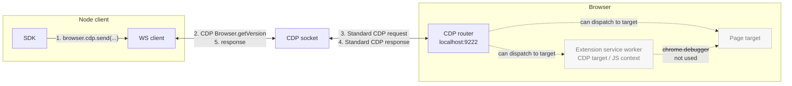
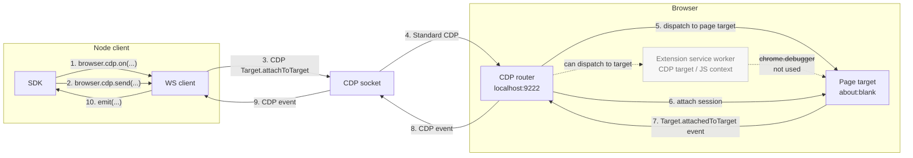
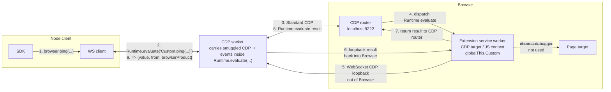
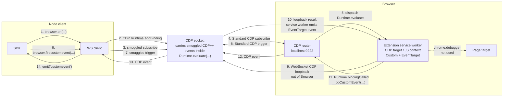

# Chrome CDP Extension Bridge

Small PoC for using a Chrome extension service worker to implement custom CDP commands (smuggled inside of standard CDP commands).

## Files

- `client.mjs`: launches Chromium, connects to browser CDP, discovers the extension service worker target, sends custom commands, receives custom events, and prints latency.
- `extension/service_worker.js`: implements the custom command/event surface exposed as `globalThis.Custom`.
- `extension/manifest.json`: minimal MV3 extension manifest.

Run:

```sh
node client.mjs
```

Or pass a Chromium executable:

```sh
node client.mjs "/path/to/chromium"
```

## Architecture

```text
external Node client
  -> browser CDP WebSocket
     - normal CDP: browser.cdp.send("Browser.getVersion")
     - normal events: browser.cdp.on("Target.attachedToTarget")

external Node client
  -> extension service worker CDP target
     - custom command: Runtime.evaluate("globalThis.Custom.ping(...)")
     - custom events: Runtime.addBinding("__bbCustomEvent")
```

Normal protocol methods stay on the browser CDP socket. Custom methods are "smuggled" by evaluating a known `globalThis.Custom.*` method inside the extension service worker target. From there, the extension can initiate its own WebSocket connection out to `localhost:9222` and re-enter Chrome through the public CDP port. Custom events come back through `Runtime.addBinding`, which emits `Runtime.bindingCalled` on the service worker CDP connection.

## Flow Diagrams

### 1. Normal CDP Call / Response



### 2. Normal CDP Event Listener / Event



### 3. Smuggled Custom Call / Response



### 4. Smuggled Custom Event Listener / Event



## Lifecycle

1. `client.mjs` launches Chromium with:
   - `--remote-debugging-port=<free port>`
   - `--remote-allow-origins=*`
   - `--load-extension=./extension`
2. The client reads `/json/version` and connects to the browser WebSocket.
3. The client scans `/json/list` for a `service_worker` target whose URL ends in `/service_worker.js`.
4. The client connects to that service worker target, enables `Runtime`, and installs `Runtime.addBinding("__bbCustomEvent")`.
5. Normal calls go through `browser.cdp.send(...)`.
6. Custom calls go through `browser.custom(...)`, which performs `Runtime.evaluate` in the service worker target.
7. Custom subscriptions call `Custom.on(...)` in the service worker. The service worker stores listeners in a plain `EventTarget`.
8. When extension logic emits an event, the service worker calls `globalThis.__bbCustomEvent(JSON.stringify(...))`; the client receives `Runtime.bindingCalled` and re-emits it through Node `EventEmitter`.

## Demo Surface

```js
const browser = new Browser();
await browser.launch();

console.log(await browser.cdp.send("Browser.getVersion"));

browser.on("Target.attachedToTarget", console.log);
browser.cdp.on("Target.attachedToTarget", console.log);
browser.on("customevent", console.log);

console.log(await browser.ping("test"));
await browser.firecustomevent("test");
```

`browser.ping(value)` calls `Custom.ping` in the extension. The extension performs a cheap loopback `Browser.getVersion` through the public CDP port and returns:

```js
{ value, from: "extension-service-worker", browserProduct: "Chrome/..." }
```

## Constraints

- This does not add real CDP methods like `Custom.ping` to Chrome. The external client owns the routing convention.
- The service worker target must be visible in `/json/list`; this PoC discovers it by URL suffix rather than extension id.
- `Runtime.evaluate` and `Runtime.addBinding` are used only against the extension service worker target, not page JS.
- Page JavaScript does not see the command surface or custom event binding.
- `--remote-allow-origins=*` is needed so extension-origin WebSockets can connect to the exposed CDP port.

## Alternatives Explored

- `chrome.debugger`: can send CDP commands to targets, but does not expose active remote-debugging clients or their raw request/response streams.
- Connecting the extension directly to `ws://localhost:9222`: the root is not a CDP WebSocket endpoint. The real browser endpoint is discovered from `/json/version`.
- Listening to another CDP client's traffic: separate CDP clients do not see each other's requests or responses.
- WebMCP: page-visible/tool-oriented, so it is not suitable when page JS must not detect the control plane.
- `Extensions.*` storage mailbox: possible in some target contexts but awkward, slower, and more brittle than directly using the extension service worker target.
- Local CDP proxy: clean and powerful, but adds another process and was not needed for this PoC.

## Latency

Latest local run uses only low-overhead local operations:

- normal call: `Browser.getVersion`
- custom call: `Custom.ping`, including extension -> localhost CDP loopback -> browser
- normal event: `Target.attachedToTarget` on the existing `about:blank` page
- custom event: extension -> localhost CDP loopback -> service-worker `EventTarget` -> `Runtime.addBinding`

```js
latencyMs {
  launchToFirstBrowserGetVersion: 1262.603,
  normalBrowserGetVersionRoundTrip: 0.654,
  smuggledCustomPingRoundTrip: 9.345,
  normalOnSubscribeTriggerEvent: 1.836,
  smuggledCustomOnSubscribeTriggerEvent: 29.592
}
```
