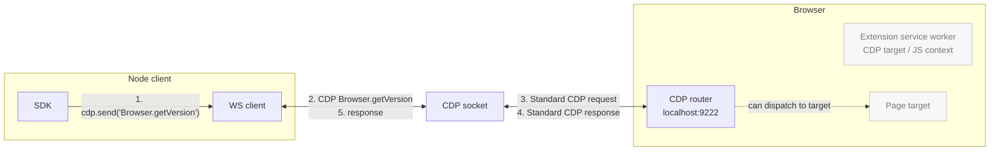
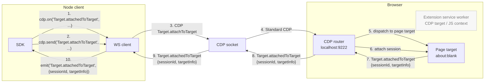
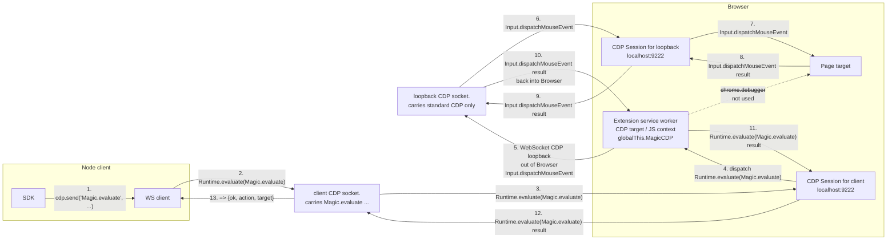
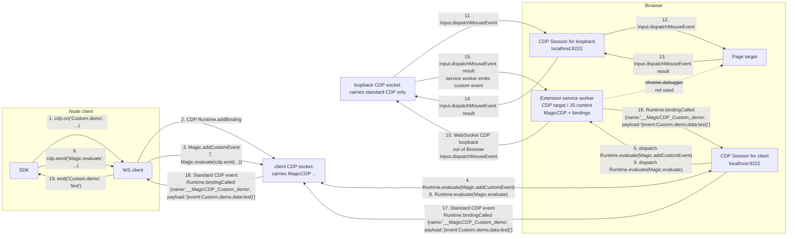

# MagicCDP

CDP is powerful but it's been stretched to many use-cases beyond its initial audience. It is difficult for agents and humans to use without a harness library, because:

- lacks the ability to use it statelessly without maintaining mappings of sessionIds, targetIds, frameIds, execution context IDs, backendNodeId ownership, and event listeners

- lacks the ability to register custom CDP commands, abstractions, and events

- lacks the ability to easily call chrome.* extension APIs for things like `chrome.tabs.query({ active: true })`

- *lacks the ability to reference pages and elements with stable references across browser runs, such as XPath, URL, and frame index, instead of unstable identifiers like sessionId, targetId, frameId, backendNodeId* (unrealistic dream? maybe not)

While I had high hopes for WebDriver BiDi, unfortunately it solves almost none of these issues.

MagicCDP does not aim to solve all of these issues directly either. Instead it solves a simpler problem: allowing us to customize and extend CDP with custom commands.
Then we use those basic primitives to fix the shortcomings in CDP by implementing our own custom events (all sent over a normal CDP websocket to a stock Chromium browser).

| Primitive                | What it does                                                                                            |
| ------------------------ | ------------------------------------------------------------------------------------------------------- |
| `Magic.evaluate`         | Run an expression in the MagicCDP extension service worker, with `chrome.*` and a `cdp` bridge in scope |
| `Magic.addCustomCommand` | Register a `Custom.*` method handler that lives in the SW                                               |
| `Magic.addCustomEvent`   | Register a `Custom.*` event your SW handlers can `emit()`                                               |
| `Magic.addMiddleware`    | Intercept service-worker-routed requests, responses, or events by name or `*`                           |

Instead of inventing yet another browser driver library, MagicCDP fixes the issue at the root.

It's perfectly compatible with playwright, puppeteer, etc. with no modifications. You can do things like `patchright` does, but generically at the CDP layer instead of having to patch libraries.

You can send `Magic.*`, `Custom.*`, etc. through standard playwright/puppeteer/other-driver-managed cdp sessions, there is a client/{py,js,go}/demo.{py,ts,go} for each language demonstrating this.

## Use it

```ts
import { MagicCDPClient } from "./client/js/MagicCDPClient.js";

const cdp = new MagicCDPClient({ cdp_url: "http://127.0.0.1:9222" });   // ws://... urls works too
await cdp.connect();

// use it like a normal CDP connection, send normal CDP, register for normal CDP events
console.log(await cdp.send("Browser.getVersion"))
cdp.on("Target.targetInfoChanged", console.log)


// ✨ use Magic to register & use new custom CDP commands!
await cdp.send("Magic.addCustomCommand", {
    name: "Custom.tabIdFromTargetId",
    expression: `async ({ targetId }) => ({
      tabId: (await chrome.debugger.getTargets()).find(t => t.id === targetId)?.tabId
    })`,
})
await cdp.send("Custom.tabIdFromTargetId", {targetId: '3423A1...'})   // -> 22352432

// ✨ set up new custom CDP events to fire + receive them just like normal CDP
// this example sets up a truly accurate "foreground focus" tracking event,
// which CDP doesn't have natively https://issues.chromium.org/issues/497896141
await cdp.Magic.addCustomEvent({
  name: "Page.foregroundPageChanged",
  eventSchema: {
    targetId: cdp.types.zod.Target.TargetID.nullable(),
    url: z.string().nullable(),
    tabId: z.number().nullable().optional(),
  },
})
await cdp.Magic.evaluate({
  expression: `chrome.tabs.onActivated.addListener(async ({ tabId }) => {
    await cdp.emit("Page.foregroundPageChanged", {
      tabId,
      targetId: (await chrome.debugger.getTargets()).find(t => t.tabId === tabId)?.id
    })
  })`,
})
cdp.on("Page.foregroundPageChanged", console.log)

// ✨ Intercept, modify, and extend existing CDP commands/events/params on the wire
await cdp.Magic.addMiddleware({
  name: "Target.targetInfoChanged",
  phase: "event",
  expression: `async (payload, next, ctx) => {
    // add .tabId next to .targetId in all Target.targetInfoChanged events the browser emits
    const {tabId} = await cdp.send('Custom.tabIdFromTargetId', payload.targetInfo)
    payload.targetInfo.tabId = tabId
    return next(payload)
  }`,
})
```

```ts
// it also provides nicely typed + zod enforced imperative-style equivalents for everything
await cdp.on(cdp.Target.targetCreated, (targetInfo: cdp.types.ts.Target.TargetInfo) => console.log(targetInfo))
console.log(await cdp.Target.createTarget({url: 'https://example.com'}))
```

## Run the demos

Each demo launches Chrome with the extension loaded, headful on macOS and `--headless=new` on Linux, then exercises every primitive in the chosen mode:

```sh
node client/js/demo.js              # defaults to --loopback; also supports --direct / --debugger
python3 client/python/demo.py
( cd client/go && go run . )
```

## Transparent Proxy

Upgrade any vanilla CDP client like Stagehand, Playwright, or Puppeteer transparently with support for `Magic.*` / `Custom.*` commands and events.

```sh
node bridge/proxy.js --upstream http://127.0.0.1:9222 --port 9223
# playwright.chromium.connect("http://127.0.0.1:9223")
# playwright page.getCDPSession().send('Magic.evaluate', {expression: '1+1'}) -> 2
# ✨ All Magic CDP commands now work through playwright! you can modify/extend playwright behavior to your heart's content
```

## Routing modes

`Magic.*` and `Custom.*` always go through the extension service worker. Routing only changes how _standard_ CDP methods (`Browser.*`, `Page.*`, `DOM.*`, …) are serviced:

| Mode         | Standard CDP path                                                  | Use when                                                                        |
| ------------ | ------------------------------------------------------------------ | ------------------------------------------------------------------------------- |
| `--loopback` | client → SW → SW dials its own WS back to localhost:9222 → CDP     | Default. You need the SW to intercept/inspect/rewrite normal traffic.           |
| `--debugger` | client → SW → `chrome.debugger.sendCommand` against the active tab | The browser exposes no remote CDP port and you only have extension permissions. |
| `--direct`   | client → sends non-Magic CDP commands to browser CDP directly      | You already have a CDP endpoint and don't need extension interception.          |

Pass via `routes: { "*.*": "direct_cdp" | "service_worker" }` on the client and `server: { routes: { "*.*": "loopback_cdp" | "chrome_debugger" } }` for the SW side. The demos default to `--loopback` (the most powerful mode).

## Repository layout

```
extension/                MV3 extension; service worker registers MagicCDPServer
  manifest.json
  service_worker.js
  MagicCDPServer.js
  translate.js           -> ../bridge/translate.js (symlink)
bridge/
  translate.js           Pure stateless wrap/unwrap (used by both Node + SW)
  launcher.js            Find chrome/chromium binary, spawn with CDP enabled
  injector.js            Discover existing SW or Extensions.loadUnpacked it
  proxy.js               Local CDP proxy (upgrades any vanilla CDP client)
client/
  js/MagicCDPClient.js + demo.js
  python/MagicCDPClient.py + demo.py
  go/MagicCDPClient.go + demo.go
```

## Requirements

- Chromium-family browser launched with `--enable-unsafe-extension-debugging` and `--remote-allow-origins=*`. Chrome Canary is the verified host for `Extensions.loadUnpacked`; other Chromium builds work too if the extension is preloaded with `--load-extension`.
- Node ≥ 22 (we use the native global `WebSocket`), Python ≥ 3.11 with `websocket-client`, Go ≥ 1.24 with `gobwas/ws`.

---

<details>
<summary><b>Architecture &amp; lifecycle</b></summary>

### Connect

1. Open a raw CDP websocket to the browser (auto-launching one via `bridge/launcher.js` if no `cdp_url` is supplied).
2. `bridge/injector.js` either discovers an existing MagicCDP service worker target or installs the extension via `Extensions.loadUnpacked`.
3. Attach a session to that SW target and `Runtime.enable` on it.
4. Optionally call `globalThis.MagicCDP.configure(...)` to push routing config into the SW (only needed when using `--loopback` or non-default server-side routing).

### Send

- `Magic.evaluate({ expression, params, cdpSessionId })` → `Runtime.evaluate` on the ext session, wrapping the expression with an IIFE that exposes `params` and `cdp = MagicCDP.attachToSession(...)`.
- `Magic.addCustomCommand({ name, expression, ... })` → `Runtime.evaluate` calling `globalThis.MagicCDP.addCustomCommand({ ... })` with the user expression embedded as the handler.
- `Magic.addCustomEvent({ name })` → `Runtime.addBinding({ name: "__MagicCDP_<name>" })`, then a `Runtime.evaluate` registering the event in `globalThis.MagicCDP`.
- `Magic.addMiddleware({ name, phase, expression })` → `Runtime.evaluate` registering a service-worker middleware for `phase: "request" | "response" | "event"`. Use `name: "*"` to match every method/event in that phase.
- `Custom.X(params)` → `Runtime.evaluate` calling `globalThis.MagicCDP.handleCommand("Custom.X", params, cdpSessionId)`.

### Receive

When SW handlers `cdp.emit('Custom.X', payload)`, the SW invokes `globalThis.__MagicCDP_Custom_X(JSON.stringify({ event, data, cdpSessionId }))`. CDP delivers `Runtime.bindingCalled` on the ext session; the client (or proxy) decodes the payload, filters by `cdpSessionId`, and re-dispatches as a normal `cdp.on('Custom.X', ...)` event.

### Why this works

`Runtime.addBinding` is the only out-of-page → in-page → out-of-page channel CDP exposes. Combined with one extension service worker (which gets `chrome.*` access as a side effect of being in an extension), you get:

- A guaranteed JS execution context that's not a page, with the right permissions
- A way to push named events back through the same CDP socket your client already speaks
- Zero extra IPC, native messaging, or sidecar processes

</details>

<details>
<summary><b>Routing details</b></summary>

```ts
type CDPUpstream = "service_worker" | "direct_cdp" | "auto" | "loopback_cdp" | "chrome_debugger";

// client-side defaults
{ "Magic.*": "service_worker", "Custom.*": "service_worker", "*.*": "direct_cdp" }

// server-side defaults (inside the SW)
{ "Magic.*": "service_worker", "Custom.*": "service_worker", "*.*": "auto" }
```

- **`service_worker`** — handle in the extension SW.
- **`direct_cdp`** (client only) — send straight to the browser CDP websocket.
- **`auto`** (server only) — try `loopback_cdp` first, fall back to `chrome_debugger`.
- **`loopback_cdp`** (server only) — SW dials a CDP websocket reachable from the browser. You may pass `http://host:port` as shorthand, but it is resolved to the concrete `ws://.../devtools/...` URL at configuration time. Useful for `Browser.*` commands that `chrome.debugger` doesn't support.
- **`chrome_debugger`** (server only) — `chrome.debugger.sendCommand` against `params.debuggee || { tabId, targetId, extensionId }`, defaulting to the active last-focused tab.

Route resolution is **deterministic across all three language clients**: exact-method match → longest-prefix wildcard → `*.*` fallback. This avoids map-iteration nondeterminism (Go) and key-insertion-order shadowing (JS/Python).

When `auto` discovery is enabled, the SW only trusts `127.0.0.1:9222` after verifying a per-connection `browserToken` round-trip — it won't accidentally connect to a different browser that happens to have the same extension installed.

</details>

<details>
<summary><b>Wire diagrams</b></summary>

#### 1. Normal CDP Call / Response



#### 2. Normal CDP Event Listener / Event



#### 3. MagicCDP Custom Call / Response



The same transport shape applies to `Magic.addCustomCommand`: the client installs a named command handler in the service worker, and later `cdp.send('Custom.someCommand', params)` is routed back through `globalThis.MagicCDP.handleCommand(...)`.

#### 4. MagicCDP Custom Event Listener / Event



</details>

<details>
<summary><b>Constraints &amp; alternatives explored</b></summary>

**Constraints**

- This does not add real CDP methods to Chrome — the wire methods stay `Runtime.evaluate` + `Runtime.bindingCalled`. The `Magic.*` / `Custom.*` namespace is a client + SW convention.
- Page JS does not see custom commands or event bindings.
- `Extensions.loadUnpacked` is Chrome Canary-verified; other builds work via `--load-extension` + the discovery path in `injector.js`.
- `--remote-allow-origins=*` is required so the extension origin can open WebSockets to `localhost:9222` for `loopback_cdp` mode.

**Alternatives considered**

- `chrome.debugger` — used as the server-side fallback, but doesn't expose other connected CDP clients or the raw protocol stream.
- Extension WebSocket → pass the actual `ws://.../devtools/browser/...` CDP endpoint directly; HTTP `/json/*` discovery is only a compatibility fallback for `http://host:port` shorthand.
- Listening to another CDP client's traffic — separate clients don't see each other's frames.
- WebMCP — page-visible/tool-oriented, unsuitable when page JS must not detect the control plane.
- `Extensions.*` storage mailbox — slower and more brittle than the SW target.
- A separate local CDP proxy process — clean, but unnecessary for the default flow; the proxy here is opt-in (only used when "upgrading" a vanilla CDP client).

</details>

<details>
<summary><b>Latency (local PoC, headless Chromium 141)</b></summary>

```
launchToFirstBrowserGetVersion:      1262.6 ms
normalBrowserGetVersionRoundTrip:       0.7 ms
smuggledCustomPingRoundTrip:            9.3 ms
normalOnSubscribeTriggerEvent:          1.8 ms
smuggledCustomOnSubscribeTriggerEvent: 29.6 ms
```

Custom roundtrip overhead is dominated by `Runtime.evaluate` + the SW's loopback CDP dial, not by wrap/unwrap. Avoid `auto` discovery in latency-sensitive paths if you can pre-configure `loopback_cdp_url` directly.

</details>
